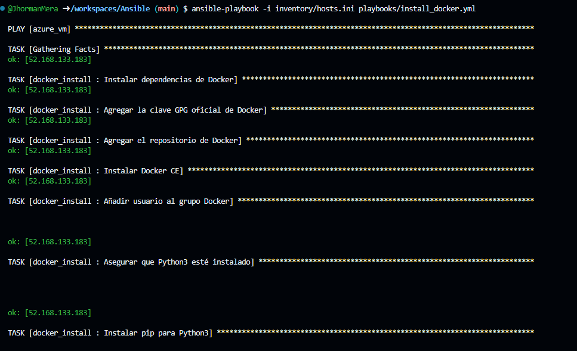

# Mario Bros-Ansible

## Descripción

Este proyecto trata de usar Ansible para orquestar y configurar software dentro de una máqina virtual que fue aprovisionada como IaC usando Terraform y Azure como proveedor de nube.

Nota: Preferiblemente usar Github CodeSpace para este proyecto para evitar errores que se pueden desencadenar por problemas de configuración en la máquina local

### Requerimientos

Es necesario que la IaC ya se encuentre funcionando y sea accesible por SSH haciendo uso de una ip pública y para este caso, la autenticación se realizará usando usuario y contraaseña.
 * Toda esta configuración inicial se puede seguir haciendo uso de la información contenida en el repositorio de [VM_Azure_modules](https://github.com/JhormanMera/VM_Azure_modules)
    * En el archivo [variables](https://github.com/JhormanMera/VM_Azure_modules/blob/main/variables.tf), se deben cambiar los valores de prefix, user y password del apartado de "Default" de cada uno.
* [Instalar Ansible](https://docs.ansible.com/ansible/latest/installation_guide/installation_distros.html)

### Paso a Paso

Para correr esta aplicación, debes seguir los siguientes pasos:

* Inicialmente se asignan permisos a la carpeta del workspace haciendo uso del comando `chmod 755 /carpeta/sub_carpeta`
    * Puede que sea necesario asignar otros permisos para lo que usaremos específicamente como `chmod 600 /carpeta/sub_carpeta` o `chmod 644 /carpeta/sub_carpeta`

* Es necesario asegurarse que el archivo de [configuración de Ansible](ansible.cfg) incluye la línea `host_key_checking = False` 

* Crear una regla de seguridad de entrada en la máquina virtual para permitir que la conexión a la páina del juego

    * Es necesario hacer un reenvio de puertos al perto previamente escogido por nosotros mismos y que contiene la app funcionando

Debe verse así: 

* Haciendo uso del comando `ansible-playbook -i inventory/hosts.ini playbooks/install_docker.yml` instalamos las dependencias y demás herramientas necesarias para nuestra solicitud

 

* El comando `ansible-playbook -i inventory/hosts.ini playbooks/run_container.yml` se encarga de levantar el contenedor y dejar el servicio activo y funcional.

Se puede observar como este comando crea el contenedor de docker dentro de la máquina virtual

## Aplicación en ejecución
En este caso, el puerto elegido para correr la app fue el `6029`

